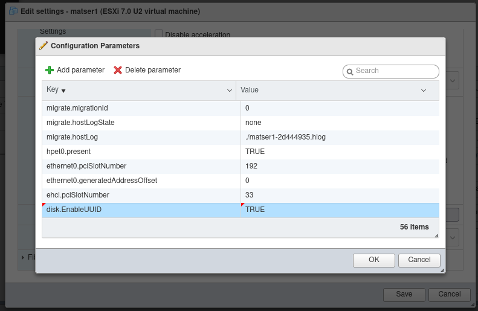
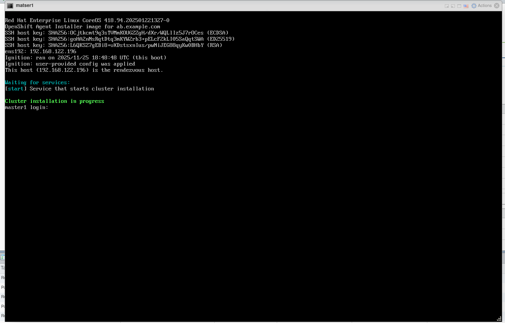

# Openshift 4 Agent based installation - ABI
In this document we are doing 3 master node installation.

1. DNS and Ha proxy will be configured on the service node. We will create the agent ISO on the service node and then attach it to the master nodes.

| Hostname | IP address     | Description                       | Hardware Requirement | 
| :-------- | :------- | :-------------------------------- | :------------------- |
| `service.example.com`      | `192.168.1.194` | `Bastion/helper Node` | 16 GB RAM  - 60GB HDD - 4 CPU |
| `master1.example.com`      | `192.168.1.196` | `Master Node` |16 GB RAM  - 60GB HDD - 4 CPU |
| `master2.example.com`      | `192.168.1.197` | `Master Node` |16 GB RAM  - 60GB HDD - 4 CPU |
| `master3.example.com`      | `192.168.1.198` | `Master Node` |16 GB RAM  - 60GB HDD - 4 CPU |

2. If you are running the VMs on Vcenter/Esxi then add enable disk.EnableUUID for the VMs by Editing the VM

Edit VM >> VM Options >> Advanced >> Edit Configuration >> 
```bash
disk.EnableUUID = "TRUE"
```


Download the openshift-install and openshift-client and extract them
```bash
wget https://mirror.openshift.com/pub/openshift-v4/clients/ocp/4.18.9/openshift-client-linux.tar.gz
wget https://mirror.openshift.com/pub/openshift-v4/clients/ocp/4.18.9/openshift-install-linux.tar.gz
tar -xvf openshift-client-linux.tar.gz -C /usr/bin
tar -xvf openshift-install-linux.tar.gz -C /usr/bin
```
Create ocp folder and create install-config.yaml and agent-config.yaml files
```bash
mkdir ocp;cd ocp
```
Create install-config.yaml
```bash
apiVersion: v1
baseDomain: example.com
metadata:
  name: ab
networking:
  networkType: OVNKubernetes
  clusterNetwork:
  - cidr: 10.128.0.0/14
    hostPrefix: 23
  serviceNetwork:
  - 172.30.0.0/16
  machineNetwork:
  - cidr: 192.168.122.0/24
controlPlane:
  name: master
  replicas: 3
  architecture: amd64
compute:
- name: worker
  replicas: 0
platform:
  none: {}
pullSecret: '{"auths"saV3"}'
sshKey: |
  ssh-ed25519 AAAAC3NzaC1lZDI1NTE5AAAAIEYiwfGoU592TWMgtB1INQhViagxPW karan@192.168.1.29
```
Create agent config agent-config.yaml

```bash
apiVersion: v1alpha1
kind: AgentConfig
metadata:
  name: ab
rendezvousIP: 192.168.122.196
hosts:
  - hostname: master1
    role: master
    interfaces:
      - name: ens192
        macAddress: 00:0c:29:98:93:aa
    rootDeviceHints:
      deviceName: "/dev/sda"
    networkConfig:
      interfaces:
        - name: ens192
          type: ethernet
          state: up
          mac-address: 00:0c:29:98:93:aa
          ipv4:
            enabled: true
            address:
              - ip: 192.168.122.196
                prefix-length: 24
            dhcp: false
      dns-resolver:
        config:
          server:
            - 192.168.122.194
      routes:
        config:
          - destination: 0.0.0.0/0
            next-hop-address: 192.168.122.1
            next-hop-interface: ens192
            table-id: 254
  - hostname: master2
    role: master
    interfaces:
      - name: ens192
        macAddress: 00:0c:29:04:f1:11
    rootDeviceHints:
      deviceName: "/dev/sda"
    networkConfig:
      interfaces:
        - name: ens192
          type: ethernet
          state: up
          mac-address: 00:0c:29:04:f1:11
          ipv4:
            enabled: true
            address:
              - ip: 192.168.122.197
                prefix-length: 24
            dhcp: false
      dns-resolver:
        config:
          server:
            - 192.168.122.194
      routes:
        config:
          - destination: 0.0.0.0/0
            next-hop-address: 192.168.122.1
            next-hop-interface: ens192
  - hostname: master3
    role: master
    interfaces:
      - name: ens192
        macAddress: 00:0c:29:79:c9:e3
    rootDeviceHints:
      deviceName: "/dev/sda"
    networkConfig:
      interfaces:
        - name: ens192
          type: ethernet
          state: up
          mac-address: 00:0c:29:79:c9:e3
          ipv4:
            enabled: true
            address:
              - ip: 192.168.122.198
                prefix-length: 24
            dhcp: false
      dns-resolver:
        config:
          server:
            - 192.168.122.194
      routes:
        config:
          - destination: 0.0.0.0/0
            next-hop-address: 192.168.122.1
            next-hop-interface: ens192
```
To create the agent ISO run below command
```bash
cd ocp;openshift-install --dir . agent create image
```
After attaching the ISO to all master nodes and starting the installation run below command on the bastion node where we generated the ISO. Below command will show us the bootstrap process.
```bash
cd ocp;openshift-install --dir . agent wait-for bootstrap-complete     --log-level=info
```
If everything is properly configured we will get following logs, which will display that installation is proceeding. Initially we may get some Warning as machines will take sometime to initialise.
```bash
openshift-install --dir . agent wait-for bootstrap-complete     --log-level=info
INFO Waiting for cluster install to initialize. Sleeping for 30 seconds 
INFO Cluster is not ready for install. Check validations 
WARNING Cluster validation: The cluster has hosts that are not ready to install. 
WARNING Host master1 validation: No connectivity to the majority of hosts in the cluster 
WARNING Host master1 validation: Host couldn't synchronize with any NTP server 
WARNING Host master1 validation: Error while evaluating DNS resolution on this host 
WARNING Host master1 validation: Error while evaluating DNS resolution on this host 
WARNING Host master1 validation: Error while evaluating DNS resolution on this host 
WARNING Host master2 validation: No connectivity to the majority of hosts in the cluster 
WARNING Host master2 validation: Host couldn't synchronize with any NTP server 
WARNING Host master2 validation: Error while evaluating DNS resolution on this host 
WARNING Host master2 validation: Error while evaluating DNS resolution on this host 
WARNING Host master2 validation: Error while evaluating DNS resolution on this host 
WARNING Host master3 validation: No connectivity to the majority of hosts in the cluster 
WARNING Host master3 validation: Host couldn't synchronize with any NTP server 
WARNING Host master3 validation: Error while evaluating DNS resolution on this host 
WARNING Host master3 validation: Error while evaluating DNS resolution on this host 
WARNING Host master3 validation: Error while evaluating DNS resolution on this host 
WARNING Host master1: validation 'belongs-to-majority-group' failed 
INFO Host master1 validation: Host NTP is synced  
INFO Host master1 validation: Domain name resolution for the api.ab.example.com domain was successful or not required 
INFO Host master1 validation: Domain name resolution for the api-int.ab.example.com domain was successful or not required 
INFO Host master1 validation: Domain name resolution for the *.apps.ab.example.com domain was successful or not required 
INFO Host master3 validation: Host NTP is synced  
INFO Host master3 validation: Domain name resolution for the api.ab.example.com domain was successful or not required 
INFO Host master3 validation: Domain name resolution for the api-int.ab.example.com domain was successful or not required 
INFO Host master3 validation: Domain name resolution for the *.apps.ab.example.com domain was successful or not required 
INFO Host master2 validation: Host NTP is synced  
INFO Host master2 validation: Domain name resolution for the api.ab.example.com domain was successful or not required 
INFO Host master2 validation: Domain name resolution for the api-int.ab.example.com domain was successful or not required 
INFO Host master2 validation: Domain name resolution for the *.apps.ab.example.com domain was successful or not required 
INFO Host master2: validation 'ntp-synced' is now fixed 
INFO Host master1 validation: Host has connectivity to the majority of hosts in the cluster 
INFO Host master2 validation: Host has connectivity to the majority of hosts in the cluster 
INFO Host master3 validation: Host has connectivity to the majority of hosts in the cluster 
INFO Host master3: updated status from insufficient to known (Host is ready to be installed) 
INFO Preparing cluster for installation           
INFO Cluster validation: All hosts in the cluster are ready to install. 
INFO Host master3: updated status from known to preparing-for-installation (Host finished successfully to prepare for installation) 
INFO Host master2: New image status quay.io/openshift-release-dev/ocp-v4.0-art-dev@sha256:0ae9703144c4b1267edea053aae38a8d2a164b30d9c645e0645a653ba375221c. result: success. time: 23.54 seconds; size: 454.16 Megabytes; download rate: 20.23 MBps 
INFO Cluster installation in progress             
INFO Host master3: updated status from preparing-successful to installing (Installation is in progress) 
INFO Host: master2, reached installation stage Writing image to disk: 24% 
INFO Host: master1, reached installation stage Writing image to disk: 57% 
INFO Host: master3, reached installation stage Writing image to disk: 62% 
INFO Host: master3, reached installation stage Writing image to disk: 100% 
INFO Bootstrap Kube API Initialized               
INFO Host: master3, reached installation stage Rebooting
```
On the Master1 node console we will see 3 out of 3 nodes are Ready, then it will display Installation in progress.

After the bootstrap completion we will get following output
```bash
INFO Host: master1, reached installation stage Waiting for bootkube: waiting for ETCD bootstrap to be complete 
INFO Bootstrap configMap status is complete       
INFO Bootstrap is complete                        
INFO cluster bootstrap is complete
```
Now it's time to monitor the installation process with below command.
```bash
openshift-install --dir . agent wait-for install-complete
openshift-install --dir . agent wait-for install-complete
INFO Bootstrap Kube API Initialized               
INFO Bootstrap configMap status is complete       
INFO Cluster installation in progress             
INFO Host: master1, reached installation stage Rebooting 
INFO Bootstrap is complete                        
INFO cluster bootstrap is complete                
INFO Cluster is installed                         
INFO Install complete!                            
INFO To access the cluster as the system:admin user when using 'oc', run 
INFO     export KUBECONFIG=/root/ocp/auth/kubeconfig 
INFO Access the OpenShift web-console here: https://console-openshift-console.apps.ab.example.com 
INFO Login to the console with user: "kubeadmin", and password: "YWiux-euuxQ-jX4ed-fSWSY" 

```
